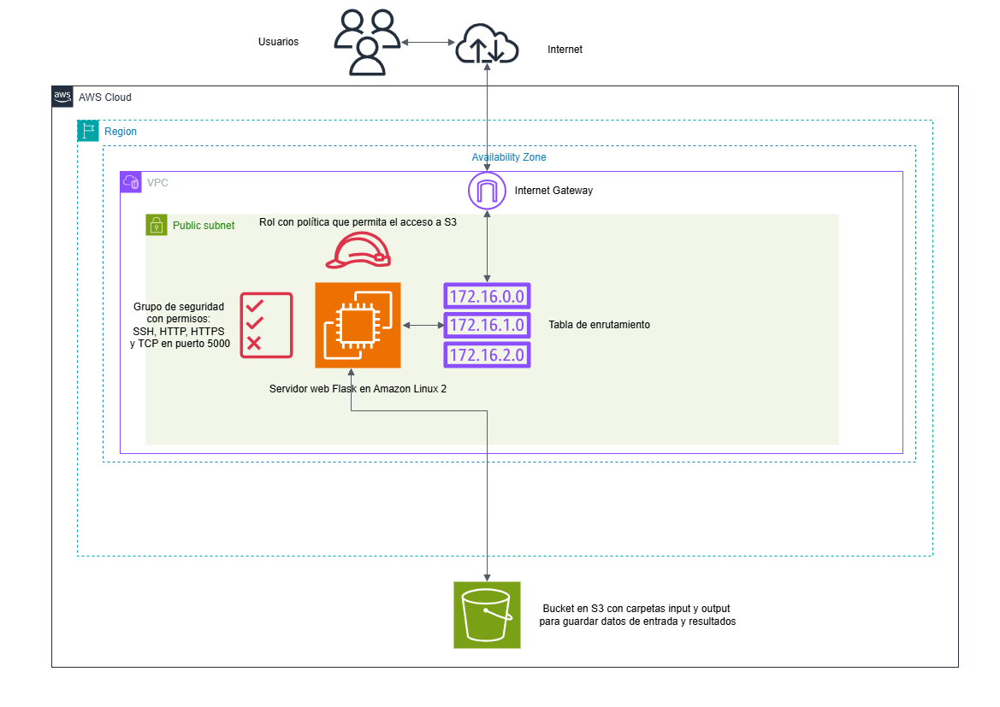
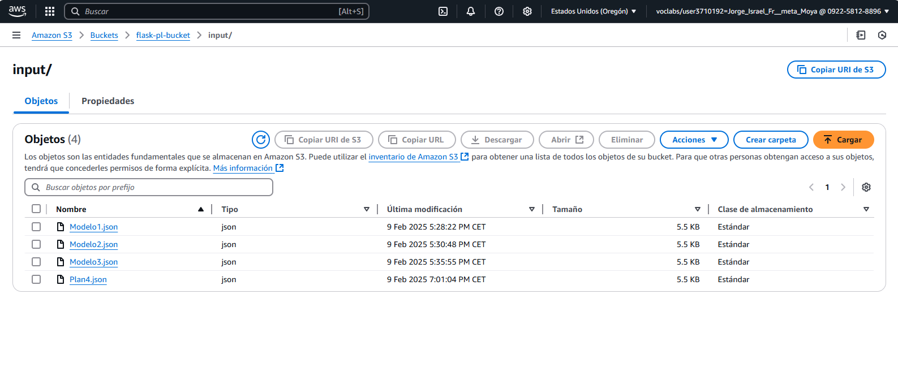
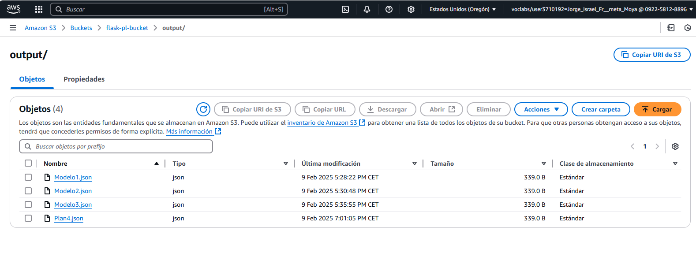
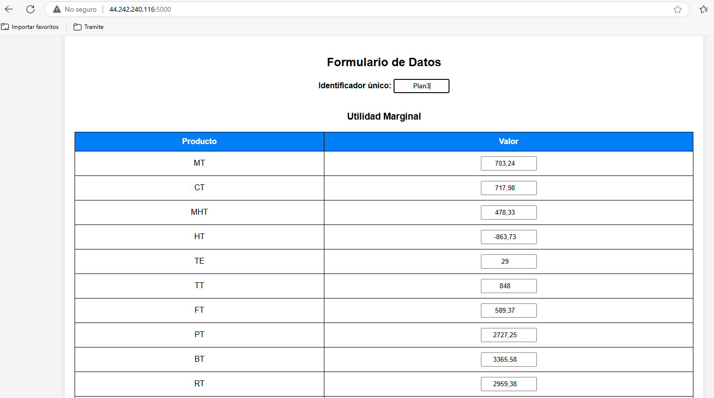
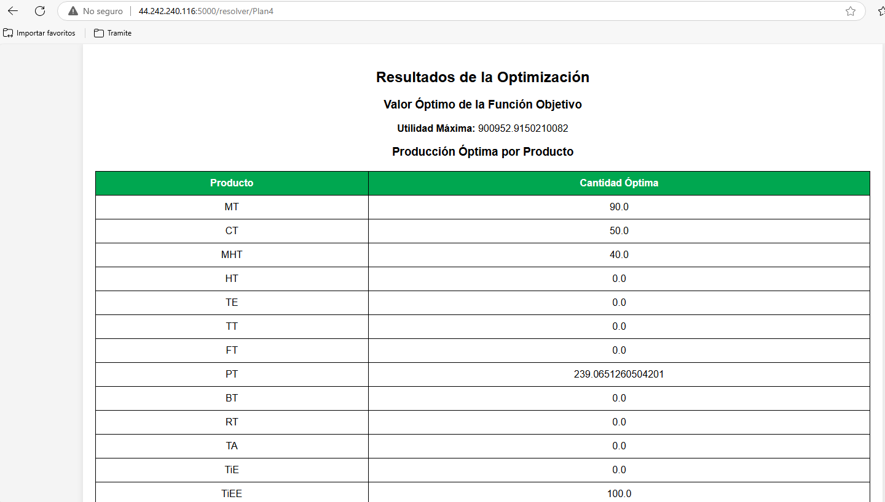
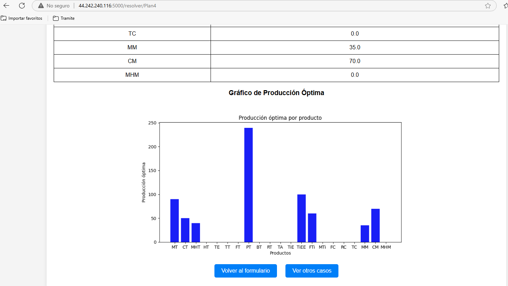

# Optimización de Producción con programación lineal usando Python, Flask, Gurobi, matplotlib y AWS  
**Proyecto Beginner en Cloud Computing con AWS**  

## Introducción  
Este proyecto es parte de una ruta de aprendizaje con enfoque práctico de servicios de **AWS**, diseñado para principiantes en **Cloud Computing**. El mismo se concibió y probó en un Sandbox de **AWS** diseñado para el aprendizaje y por tanto con restricciones en su uso. Su objetivo es proporcionar una experiencia práctica en el uso de servicios de Cloud Computing como **AWS EC2, S3 y otros servicios asociados como VPC, IAM**, combinando estos con una implmentación de una aplicación web usando **Python** con **Python SDK para AWS, Gurobi, Matplotlib y Flask** para resolver un modelo de **optimización matemática** basado en un caso de estudio real.  

**Referencia científica:**  
El modelo matemático está basado en la publicación:  
📄 [Planificación productiva del procesamiento pesquero en Santiago de Cuba mediante programación lineal"](https://dialnet.unirioja.es/servlet/articulo?codigo=9472260).  
*(El PDF del artículo está incluido en este repositorio para consulta académica.)*  
**Nota:** Aunque este modelo está basado en el artículo, los datos utilizados aquí son ficticios y no corresponden a los datos reales de la publicación. También se emplea gurobipy junto al solver con licencia académica no apata para la producción de Gurobi, en vez de pyomo y el solver CBC como en la publicación original.

Para cumplimentar el objetivo trazado se divide el proyecto en 4 fases con una serie de pasos con vista a implementar una arquitectura en la nube de **AWS**. El diseño de la arquitectura se puede observar a continuación:



🛠️ **Tecnologías utilizadas:**  
-  **AWS EC2** → Para implementar servidor que despliegue la aplicación web.
-  **Flask** → Para la interfaz web.
-  **Gurobi** → Para la optimización matemática.
-  **AWS S3** → Para almacenamiento de datos.
-  **Otros servicios de AWS como VPC y IAM** → Para garantizar la funcionalidad y la seguridad de la arquitectura.
-  **Matplotlib** → Para visualización de resultados.  

---

# **Fase 1: Configurar una instancia EC2 en AWS**  
**Objetivo:** Tener una instancia EC2 lista para ejecutar Flask, Matplotlib, Gurobi y conectar con S3.  

### **Pasos a seguir:**  
- **Crear la VPC y la infraestructura de red**.  
-- Subnet pública, tabla de enrutamiento, Internet Gateway.  
-- ACL y Grupo de Seguridad con permisos **SSH** (para acceder al command line de la instancia), **HTTP y HTTPS** (para permitir que la instancia descargue archivos necesarios desde Internet) y **TCP en puerto 5000** (para poder acceder al servidor Flask una vez en funcionamiento).  
-- IAM Role con permisos restringidos de acceso a S3.  

- **Configurar la instancia EC2:**  
-- **AMI:** Amazon Linux 2  
-- **Tipo:** `t2.micro` (capa gratuita)  
-- **Almacenamiento:** 8 GiB, gp3, 3000 IOPS  
-- **Acceso:** Llaves SSH y asociación con la subnet pública  

- **Ejecutar el script en la instancia: `scripts/setup_ec2.sh`**.

El script permite instalar los módulos necesarios para la ejecución del proyecto, tales como **Flask, Python SDK para AWS, Gurobipy y Matplotlib**. También permite configurar la licencia de **Gurobi** para el uso del solver por parte de gurobipy.

Fragmento de ejemplo del código:

```bash
#!/bin/bash
sudo yum update -y
sudo yum install -y aws-cli python3-pip
pip3 install flask boto3 gurobipy matplotlib

grbgetkey XXXXXXXX-XXXXXXXX-XXXXXXXX
```

- **Configurar credenciales de AWS:**

Fragmento de ejemplo del código:

```bash
aws configure
```

---

# **Fase 2: Configurar un Bucket S3 en AWS**  
**Objetivo:** Crear un bucket S3 con permisos adecuados.  

- Crear un bucket con carpetas:  
-- `/input/` → Almacena datos ingresados.  
--`/output/` → Almacena resultados del modelo.

- **Configuración en la aplicación web de Flask `app.py`**

Fragmento de ejemplo del código:
```python
s3.put_object(Bucket=S3_BUCKET, Key=file_name, Body=json.dumps(datos))
```
Un ejemplo, tanto de los datos de entrada como los resultados del modelo almacenados en el bucket de AWS S3 se puede visualizar en las siguientes imágenes:



---

# **Fase 3: Implementar el modelo de optimización**  
**Objetivo:** Diseñar el modelo de optimización con gurobipy de manera que el usuario interactúe  desde la web.  

- **Definición del modelo en `modelo.py`** 

Fragmento de ejemplo del código:
```python
problema = gp.Model("Plan de Producción")

# Variables de decisión
vars_prod = problema.addVars(productos, name='Cant_Product', lb=0)

# Restricciones
problema.addConstrs(
    (gp.quicksum(vars_prod[i] * coef_tecn_prod_mat_prima[j][i] for i in productos) <= disp_mat_prima[j]
     for j in materias_primas),
    name='Restricción_Materias_P'
)

# Función objetivo
problema.setObjective(
    gp.quicksum(vars_prod[i] * utilidad_marginal[i] for i in productos),
    GRB.MAXIMIZE
)

problema.optimize()
```

**Salida esperada:** Un JSON con la **producción óptima** y el **valor de la función objetivo**.

---

# **Fase 4: Integración de los datos de entrada, la resolución del modelo y los resultados del mismo en una aplicación web con Flask**
Se desarrolló una aplicaci en **Flask** donde los usuarios pueden:  
- **Ingresar datos en un formulario web** (ver templates/form.html).  
- **Resolver el modelo con un clic.**  
- **Visualizar los resultados incluyendo gráfico**(ver templates/resultado.html)  

**Ejemplo de código en `app.py`**
```python
@app.route('/resolver/<dataset_id>')
def resolver(dataset_id):
    file_name = f"{INPUT_FOLDER}{dataset_id}.json"
    obj = s3.get_object(Bucket=S3_BUCKET, Key=file_name)
    datos = json.loads(obj['Body'].read().decode('utf-8'))

    resultado = resolver_modelo(datos)
    s3.put_object(Bucket=S3_BUCKET, Key=f"{OUTPUT_FOLDER}{dataset_id}.json", Body=json.dumps(resultado))

    return render_template('resultado.html', resultado=resultado, grafico=grafico_barras(resultado))
```
Un ejemplo del formulario web para los datos de entrada en la aplicación web de Flask corriendo en el servidor se puede visualizar en las siguientes imágenes:




Un ejemplo la visualización de los resultados del modelo en la aplicación web de Flask corriendo en el servidor se puede visualizar en las siguientes imágenes:




---

# 🎯 **Conclusión**
Este proyecto permite a principiantes en **Cloud Computing** experimentar con los servicios de **AWS** en un entorno práctico, combinando optimización matemática con Gurobi y programación web con Python.  

**Posibles mejoras:**  
- Implementar autenticación con AWS Cognito.  
- Implementar el modelo de optimización con **Gurobi** en **AWS Lambda**.
- Desplegar Flask con **Docker** y **AWS ECS**.  
- Mejorar la visualización con **Dash o Streamlit**.  

📄 **Referencia científica:** [Artículo en Dialnet](https://dialnet.unirioja.es/servlet/articulo?codigo=9472260).  

**¡Dime qué te pareció y si quieres colaborar!** 😃
